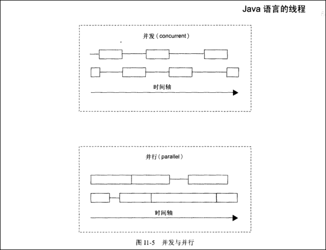

##正文##

- 何谓线程
	- 单线程与多线程

	正在执行程序的主题只有一个称为单线程。我们在解读程序时，看起来好像是顺着处理流程追下去，事实上是在追着线程的操作

	由1个以上的线程所构成的程序称为多线程程序（GUI应用程序，比较花费时间的I/O处理，多个客户端）

	- Thread类、run方法和start方法
	
	**被调用出来启动新线程的是start方法，而非run方法。调用start方法时，会有两个操作（启动新的线程-->调用run方法）**
	- 并发与并行

	计算机只有1个中央处理器，根本不可能真正同时进行1个以上的处理。事实上，程序的处理是像这样不断切换有操作的线程，这种操作就称为并发（concurrent）

	如果有1个以上中央处理器的计算机上跑的java执行处理系统，则线程操作可能是并行（paralle）而非并发。当1个以上的线程并行操作时，就可以真正同时进行1个以上的处理。

	

- 线程的启动
	- Thread类、Runnable接口

	1. 利用Thread类的子类的实例，启动线程
	2. 利用Runnable接口的实现类的实例，启动线程

- 线程的暂时停止
	sleep方法

- 线程的共享互斥
	synchronized方法，synchronized语句和锁定

- 线程的协调
	- Wait set、wait方法、notify方法和notifyAll方法

	**如欲执行wait()、notify()、notifyAll()方法，线程需获取锁定（这是规则）**

	- 选择notify的话，因为要唤醒的线程比较少，程序处理速度当然要比notifyAll略胜一筹。
	但选择notify是，若这部分处理得不好，可能会有程序挂掉的危险性。一般说来，选择notifyAll所写出来的程序代码会比选择notify可靠。


##练习问题##

- 为什么输出结果不是*和+交错混杂呢？
```

public class Main{
	public satic void main(String[] args){
		new PrintThread("*").run();
		new PrintThread("+").run();
	}
}

public class PrintThread extends Thread{
	private String message;

	public PrintThread(String message){
		this.message=message;
	}

	public void run(){
		for(int i=0;i<100;i++){
			System.out.print(message);
		}
		
	}
}
```

**run方法并不是由新线程执行的原因，是因为由主线程执行的原因，这个程序时单一线程（single Thread）的程序。**

- 程序里面有错误，为什么错了呢？

```
MyThread t=new MyThread();
t.start();
try{
	t.sleep(1000);
}catch(InterruptedException e){
}
```

**t.sleep(1000)容易招致误解，并非加上了t的线程，而是执行此语句的线程使用，而是Thread类的方法。最佳写法为Thread.sleep(1000)**

- 若该组合可供1个以上的线程同时执行，则打O；该组合不允许1个以上的线程同时执行，则打×.

```
public class Something{
	public void iA(){}
	public void iB(){}
	public synchronized void iSyncA(){}
	public synchronized void iSyncB(){}
	public static void cA(){}
	public static void cB(){}
	public static synchronized void cSyncA(){}
	public static synchronized void cSyncB(){}
	
}

//变量x,y则表示Something类的不同实例

(1) x.iA() 与 x.iA()
(2) x.iA() 与 x.iB()
(3) x.iA() 与 x.iSyncA()
//只要是synchronized以外的方法，都可以从两个线程执行。即使有线程在执行其他synchronized方法，也仍能执行。


(4) x.iSyncA() 与 x.iSyncA()
(5) x.iSyncA() 与 x.iSyncB()
//相同实例的synchronized的实例方法，一次只能由一个线程来执行

(6) x.iSyncA() 与 y.iSyncA()
(7) x.iSyncA() 与 y.iSyncB()
//由于实例不同则锁定（lock）也不同，因此即使是synchronized的实例方法也能从两个以上的线程来同时执行


(8) x.iSyncA() 与 Something.cA()
//类方法本来就不是synchronized方法，因此可以同时执行
(9) x.iSyncA() 与 Something.cSyncA()
//synchronized的实例方法与synchronized的类方法由于锁定（lock）不同，
//因此可以从数个线程来同时执行。


(10) Something.cSyncA() 与 Something.cSyncA()
(11) Something.cSyncA() 与 Something.cSyncB()
//synchronized的类方法无法从数个线程同时执行
(12) x.cSyncA() 与 y.cSyncB()
//x.cSyncA()调用的方法是Something.cSyncA(),
//而 y.cSyncB()调用的方法是Something.cSyncB(),
//因此都会变成synchronized的类方法，所以无法从数个线程同时执行

```